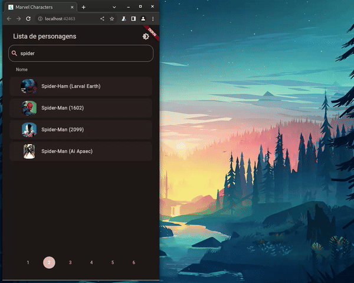
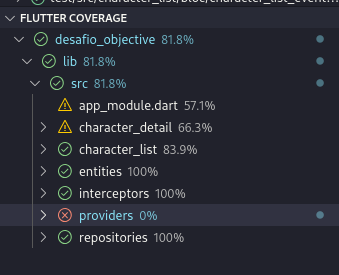
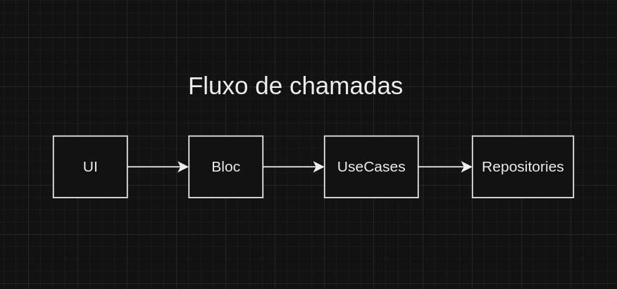
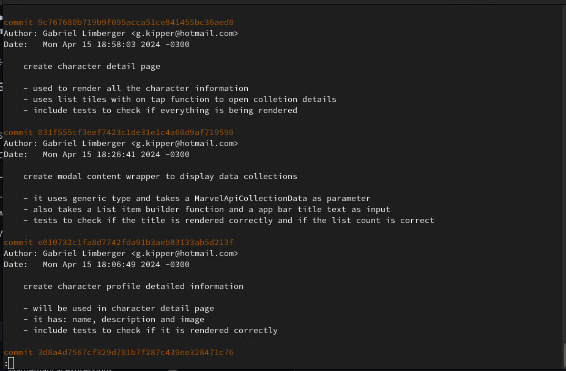

## Configuração

É necessário inserir as chaves da API da Marvel, elas não foram enviadas ao reposistório. Para fazer isso, utilize o arquivo "APICredentials.dart" localizado em na pasta src/providers; 
Deixar chaves privadas dentro do app nao é uma boa prática, o ideal seria implementar um servidor intermediário para guardar o segredo e evitar trafegar dados sensíveis.


## Testes
Foram implementados testes unitários, testes de widgets e testes de integração:
Para rodar os testes unitário e de widgets, use o comando

```bash
flutter test
```


para executar os testes de integração:

```bash
flutter test ./integration_test
```

atualmente o projeto está com 85 testes testes e com uma cobertura de código de 81%




## Arquitetura
Para este app foi utilizado uma arquitetura similar a clean architecture, onde buscamos separar e isolar as camadas para um melhor desacoplamento e testabilidade.

O app faz uso business logic component(bloc) para construir sua interface, este que por sua vez se comunica com os casos de uso definidos, que são responsáveis pelas lógicas de negógio.
Caso necessário, os casos de uso podem fezer chamadas para recursos externos, neste caso, foi implementado um padrão de projeto Repository, posibilitando multiplas implementações e fácil substituição por "Mocks" para realizar testes.




## Interface de usuário
Para facilitar o composição das telas, melhorar a testabilidade, e seguir o princípio de responsabilidade única, foi optado por dividir ao máximo os widgets.
além de cada widget fazer apenas uma coisa, também não há depedência entre widgets, e nos caso em que há a necessidade de troca de informações entre eles, isso é feito usando streams(bloc) e inherited widgets(provider).


## Git Log
Todos os commits possuem descricao e detalhemento, facilitado entender a linha temporal do código.




